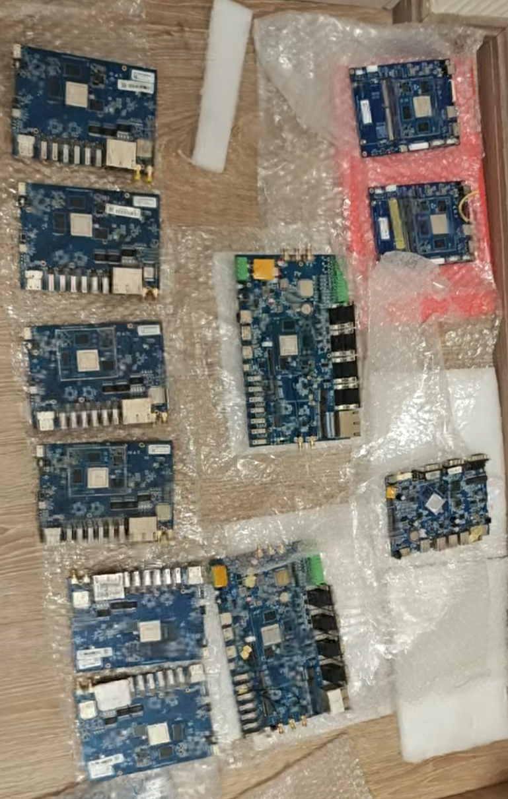
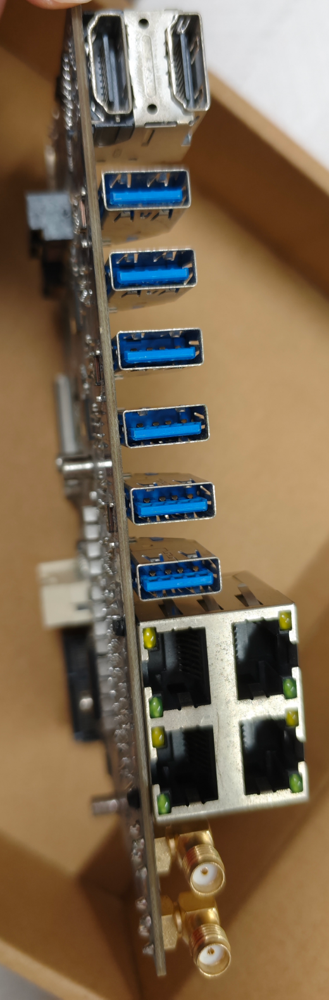
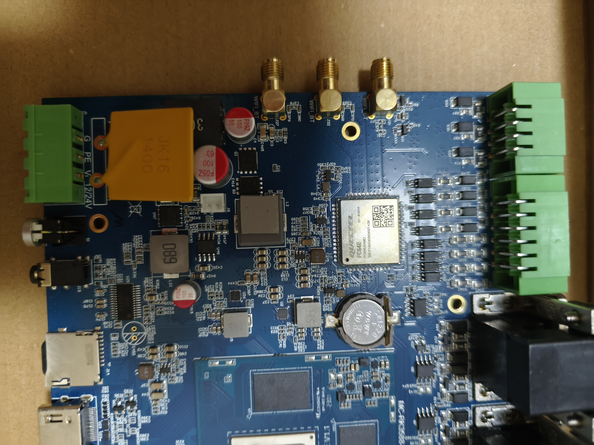

# mc-rk3588

* 电源采用12V、24V均可
* 支持亮钻的D3588 Linux/Android 系统，整体可以启动，需要微调一下外设USB、网卡。
* 四千兆网口、带mstata接口、4G接口、5G接口、HDMI、6个USB
* 属于研发板子，部分带有飞线
* 内存8G，emmc 64G
* dtb已提取，参看仓库official目录下的文件

```text
{
	compatible = "rockchip,rk3588-mc-ba1201\0rockchip,rk3588";
	interrupt-parent = <0x01>;
	#address-cells = <0x02>;
	#size-cells = <0x02>;
	model = "Rockchip RK3588 MC BA1201 Board";
	...
```


---










